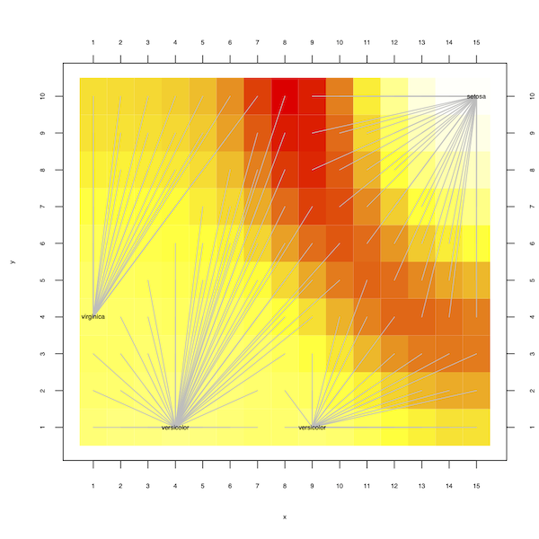
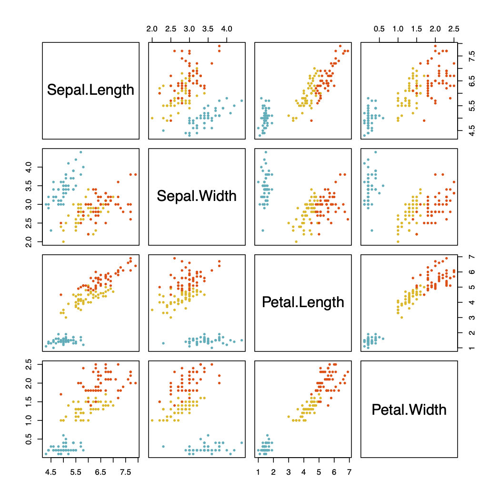

# Background

The self-organizing map (SOM) was developed by Teuvo Kohonen for data exploration and
data visualization in the 1980s [@kohonen2001self]. It is an artificial neural
network designed for unsupervised learning.  What makes the self-organizing map so attractive are the intuitive mathematical
underpinnings and the straightforward visualization of computational
results [@ultsch1990self]. Self-organizing maps have been applied in virtually every scientific discipline where some sort of data exploration or analysis is
necessary, e.g., [@liakos2018machine; @mathys2019single; @matic2018interpreting;
@miller1996star].  A number of R-packages exist that implement self-organizing maps including
[@kohonen2018jss] and [@som2016R].


# Statement of need

Training a self-organizing map is time consuming. Here
we introduce an R-package called `popsom` [@popsom2021R] that implements a training algorithm
for self-organizing maps based on vector and matrix operations inspired by
tensor algebra [@hamel2018vsom].  We have measured speed ups of the training phase
of a SOM  of up to 60 times using our implementation over traditional implementations of the training algorithm such as
[@som2016R].  This speedup enables researchers to look at much larger data sets or to improve
their throughput with a given data size.

Visualization of a trained map is at the core of using self-organizing maps.  The
`popsom` package improves on the standard u-matrix visualization
for self-organizing maps [@ultsch1990self] by superimposing starbursts in order to
highlight cluster structures [@hamel2011improved].

# Description

At a slightly more detailed level, our `popsom` package implements
Kohonen's self-organizing maps with a number of distinguishing features:

1. A very efficient, single threaded, stochastic training algorithm based on ideas from tensor algebra.  Up to 60x faster than traditional single-threaded training algorithms. No special accelerator hardware is required.  The speedup results from the fact that the
vector and matrix structures exposed by our algorithm map neatly into
vector and matrix operations available on today's CPUs.  Our Fortran 90 implementation
insures that these vector and matrix operations are mapped onto the hardware as efficiently as
possible [@hamel2018vsom].

2. Automatic centroid visualization and detection using starbursts [@hamel2011improved]. Not
only does `popsom` display clusters and centroids on the map using starbursts but it
also computes a cluster model similar to a k-means model based on the starbursts.  

3. The `popsom` package maintains two models of the given training data: (a) a
self-organizing map model where elements of the map model are available to
the user for analysis, and (b) a centroid based clustering model similar to a k-means
model where centroid and cluster information is available to the user.  Having these
two perspectives of a dataset is often helpful during a data analysis.

4. The package provides a number of easily accessible quality metrics for the self-organizing map and the centroid based cluster models [@hamel2016som; @tatoian2018self]. In particular, the package computes the `convergence` of a map which is a linear combination of the variance captured and the topographic fidelity of the map. A value close to 1 of this metric indicates a converged map. Furthermore, `popsom` also computes the `separation` of the clusters
in a model.  In general, a value close to 1 means well separated clusters.

# Usage

`popsom` is available on [CRAN](https://CRAN.R-project.org/package=popsom) and can be installed and loaded into an R session using,
```
> install.packages("popsom")
> library(popsom)
```
Binary packages for `popsom` are available from CRAN for macOS, Linux, and Windows.  If you are on a system
that is not supported by CRAN, you can download and compile the package from
[GitHub](https://github.com/lutzhamel/popsom).

The following is a simple use-case for `popsom` exercising some of the functionality
it has to offer. We start by constructing a model,
```
> ## load a data set
> data(iris)
>
> ## set data frame and labels
> df <- subset(iris,select=-Species)
> labels <- subset(iris,select=Species)
>
> ## build a self-organizing map
> m <- map.build(df,labels,xdim=15,ydim=10,train=100000,seed=42)
>
> ## compute a summary and display it
> map.summary(m)

Training Parameters:
  xdim ydim alpha train normalize seed instances
    15   10   0.3 1e+05     FALSE   42       150

Quality Assessments:
  convergence separation clusters
         0.94       0.93        4

>
```
The `map.summary` function gives us a quick snapshot of relevant model information. Perhaps
the most interesting thing here are the `Quality Assessments`. The `convergence` value is a linear
combination of the estimated topographic accuracy and the embedding accuracy.  The latter roughly
corresponds to the amount of training data variance the map models [@hamel2016som].  Convergence values of 0.8 and
better are considered hallmarks of high quality maps.  The `separation` value is computed with the
formula,
```
1 - wcss/bcss
```
where `wcss` is the average within cluster sum of squares and `bcss` is the average between cluster sum
of squares.  This computation is a quick way of assessing
the quality of the computed clusters.  Here, a value close
to one usually indicates a good cluster model.

We can look at details of the centroids of the model,
```
> ## look at the centroids of the model
> lc <- m$unique.centroids
> ll <- m$centroid.labels
> for (i in 1:length(lc))
+ cat("(",lc[[i]]$x,",",lc[[i]]$y,") -> ",ll[[lc[[i]]$x,lc[[i]]$y]],"\n")
( 4 , 1 ) ->  versicolor
( 1 , 4 ) ->  virginica
( 9 , 1 ) ->  versicolor
( 15 , 10 ) ->  setosa
>
```
The map model maintains information about the centroids which we can access.  Here
we access that information in order to print out the coordinates of the centroids on the map
together with their assigned labels.  We can easily verify this information using
the starburst plots the package provides,
```
> ## display a starburst plot of the map model
> map.starburst(m)
```
The starburst visualization shown
in \autoref{fig:map}.  The centroids we extracted from the model earlier are easily
identified on this visualization.  The starbursts indicate the extend of clusters around
each centroid and the colors of the heatmap indicate the "tightness" of the clusters.
Hot, yellow usually indicated tight clusters whereas reddish colors indicate looser clusters or
borders of clusters.  Here we can see that the "versicolor" and "virginica" clusters are more similar
to each other and that the "setosa" cluster is separated from the other clusters by some
distance. This is easily verified with a scatter plot matrix of the iris dataset using
```
> colors <- c("#00AFBB", "#E7B800", "#FC4E07")  
> pairs(iris[,1:4], pch = 19,  cex = 0.5,
+       col = colors[iris$Species])
>
```
and shown in \autoref{fig:scatter}.  The blue cluster is the "setosa" cluster and it is easy to see that
it is well separated from the other clusters.

A more involved usage example can be found on
[Kaggle](https://www.kaggle.com/lutzhamel/self-organizing-maps-in-customer-segmentation).





# Performance

In order to highlight the kind of performance gains you can expect from using our package we
provide a simple
[benchmark script](https://github.com/lutzhamel/popsom/blob/master/package/performance/popsom-perf.r)
in our repository.
The script uses two real world datasets and one synthetic dataset.
The output of the script is (slightly edited for readability),
```
[1] "times are reported in milliseconds"

[1] "### Iris ###"
  package   mean time
1  popsom         1.7
2     som        17.2
3 kohonen       128.6

[1] "### Wines ###"
  package   mean time
1  popsom         3.2
2     som        21.8
3 kohonen       281.0

[1] "### Sim ###"
  package   mean time
1  popsom         2.8
2     som        33.9
3 kohonen      1975.9
```
This output shows that `popsom` is about an order of magnitude
faster than `som` and almost two orders of magnitude faster than the `kohonen` package. A
more detailed performance analysis of the `popsom` package appears in [@hamel2018vsom].

# Acknowledgements

We would like to thank the University of Rhode Island for financial support of
this project through their 'Project Completion Grants.' A special thanks to the
following people for their contributions to the project
in no particular order: Benjamin Ott, Gregory Breard,  Robert Tatoian,
Michael Eiger, and Vishakh Gopu.  We also would like to thank sthda.com for their
[wiki on scatterplots](http://www.sthda.com/english/wiki/scatter-plot-matrices-r-base-graphs).

# References
